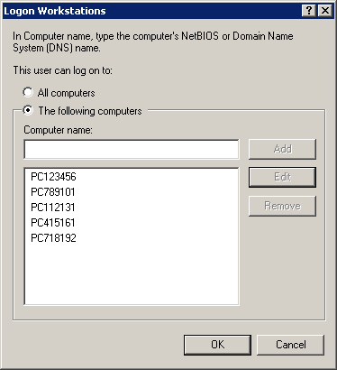
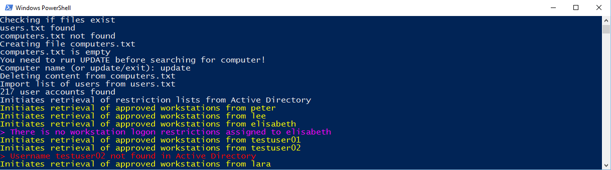
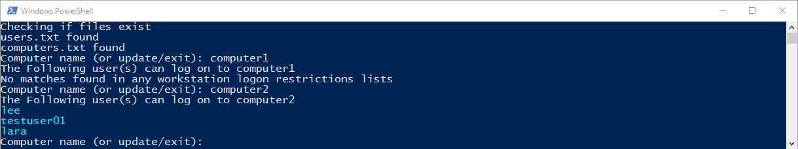

# Find users with a spesific computer listed in Active Directory Logon Workstations
A PowerShell script to search for a specific computer in multiple users' Active Directory User-Workstations logon restriction list (Log On To)

**What is "Active Directory Logon Workstations"**  
In properties for a Active Directory-user you can by clicking the "Log On To"-button in the "Account"-tab choose  if the user can log on to "All computers" or "The following computers".  
"All Computers" is the default, and in most cases the preferred option. But somtimes it is convenient to limit certain users to certain computers. In these cases the "The following"-option is selected and a list of computers is specified in the underlying list.  
  
  
**Why the script is useful**  
In Actiive Directory there is no way to search for a computer and find which user accounts that have this computer listed as allowed in the "The following computers"-list in "Logon Workstations". With this script you CAN do just that.  
  
**How To use**  
Before you can use this script the "Quest ActiveRoles Management Shell" must be istalled. This was freeware until v1.5.1 and can be downloaded here:  
http://www.powershelladmin.com/wiki/Quest_ActiveRoles_Management_Shell_Download  
Create a file named "users.txt" in the same directory as the script. In the text file set in a list of usernames that you want to chack, separation with newline  
  
**Example**  
  
    TestUser1
    TestUser2
    TestUser3
    TestUser4
    TestUser5
    
The minimum amount of users in the list is two. There is no (known) upper limit but the script will run slow if it is a high number of users listed. I therefore recommend that only users who actually have workstation-restriction are listed in the textfile.
When the user list is created you can run the script.  
  
The script wil check if the list is ok, and create another textfile "computers.txt". Never edit this file, it is for the script to store information exported from Active Directory.  
First time you run the script you must first run, and complete an update with command "UPDATE".  
This must also be done each time you edit the users.txt. The consequence of not running "UPDATE" after editing users.txt is wrong results and/or powershell errors.  
This is very important because the script work by comparing the line-numbers of the two text files.  
  
**Screenshots**  
Example of update  

Example of search  

